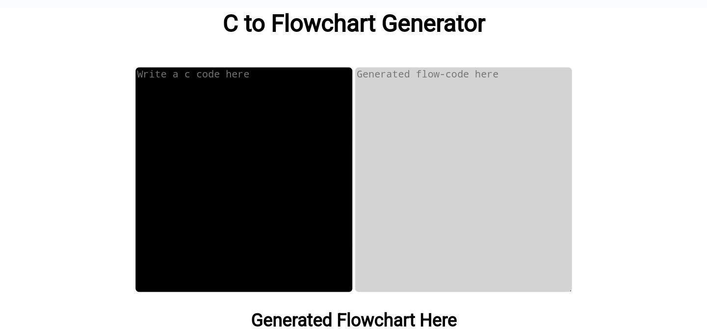

# C to Flowchart Generator


C to Flowchart Generator show us graphical representation of execution step of C code.
### C Code Examples
1.
```C++
#include <stdio.h>
int main() 
{
   printf("Hello, World!");
}
```
2.
```C++
#include <stdio.h>
int main() {   
    int number;
   
    printf("Enter an integer: ");  
    
    // reads and stores input
    scanf("%d", &number);

    // displays output
    printf("You entered: %d", number);
    
    return 0;
}
```
3.
```C++
#include <stdio.h>
int main() {
    int num;
    printf("Enter an integer: ");
    scanf("%d", &num);

    // true if num is perfectly divisible by 2
    if(num % 2 == 0)
        printf("%d is even.", num);
    else
        printf("%d is odd.", num);
    
    return 0;
}
```
4.
```C++
#include <stdio.h>
int main() {
   int year;
   printf("Enter a year: ");
   scanf("%d", &year);

   // leap year if perfectly divisible by 400
   if (year % 400 == 0) {
      printf("%d is a leap year.", year);
   }
   // not a leap year if divisible by 100
   // but not divisible by 400
   else if (year % 100 == 0) {
      printf("%d is not a leap year.", year);
   }
   // leap year if not divisible by 100
   // but divisible by 4
   else if (year % 4 == 0) {
      printf("%d is a leap year.", year);
   }
   // all other years are not leap years
   else {
      printf("%d is not a leap year.", year);
   }

   return 0;
}
```
5.
```C++
#include <stdio.h>

int main() {

    double num;
    printf("Enter a number: ");
    scanf("%lf", &num);
    if (num <= 0.0) {
        if (num == 0.0)
            printf("You entered 0.");
        else
            printf("You entered a negative number.");
    } 
    else
        printf("You entered a positive number.");

    return 0;
}
```
6.
```C++
#include <stdio.h>
int main() {
    int n, i;
    unsigned long long fact = 1;
    printf("Enter an integer: ");
    scanf("%d", &n);

    // shows error if the user enters a negative integer
    if (n < 0)
        printf("Error! Factorial of a negative number doesn't exist.");
    else {
        for (i = 1; i <= n; ++i) {
            fact *= i;
        }
        printf("Factorial of %d = %llu", n, fact);
    }

    return 0;
}
```
7.
```C++
#include <stdio.h>

int main() {

  int n, reverse = 0, remainder;

  printf("Enter an integer: ");
  scanf("%d", &n);

  while (n != 0) {
    remainder = n % 10;
    reverse = reverse * 10 + remainder;
    n /= 10;
  }

  printf("Reversed number = %d", reverse);

  return 0;
}
```
8.
```C++
#include <stdio.h>
int main() {
  int n;
  double arr[100];
  printf("Enter the number of elements (1 to 100): ");
  scanf("%d", &n);

  for (int i = 0; i < n; ++i) {
    printf("Enter number%d: ", i + 1);
    scanf("%lf", &arr[i]);
  }

  // storing the largest number to arr[0]
  for (int i = 1; i < n; ++i) {
    if (arr[0] < arr[i]) {
      arr[0] = arr[i];
    }
  }

  printf("Largest element = %.2lf", arr[0]);

  return 0;
}
```
9.
```C++
#include <stdio.h>
int main() {
  int a[10][10], transpose[10][10], r, c;
  printf("Enter rows and columns: ");
  scanf("%d %d", &r, &c);

  // asssigning elements to the matrix
  printf("\nEnter matrix elements:\n");
  for (int i = 0; i < r; ++i)
  for (int j = 0; j < c; ++j) {
    printf("Enter element a%d%d: ", i + 1, j + 1);
    scanf("%d", &a[i][j]);
  }

  // printing the matrix a[][]
  printf("\nEntered matrix: \n");
  for (int i = 0; i < r; ++i)
  for (int j = 0; j < c; ++j) {
    printf("%d  ", a[i][j]);
    if (j == c - 1)
    printf("\n");
  }

  // computing the transpose
  for (int i = 0; i < r; ++i)
  for (int j = 0; j < c; ++j) {
    transpose[j][i] = a[i][j];
  }

  // printing the transpose
  printf("\nTranspose of the matrix:\n");
  for (int i = 0; i < c; ++i)
  for (int j = 0; j < r; ++j) {
    printf("%d  ", transpose[i][j]);
    if (j == r - 1)
    printf("\n");
  }
  
}
```
10.
```C++
#include <stdio.h>
int main() {
   int i, j, rows;
   printf("Enter the number of rows: ");
   scanf("%d", &rows);
   for (i = 1; i <= rows; ++i) {
      for (j = 1; j <= i; ++j) {
         printf("* ");
      }
      printf("\n");
   }
   return 0;
}
```

