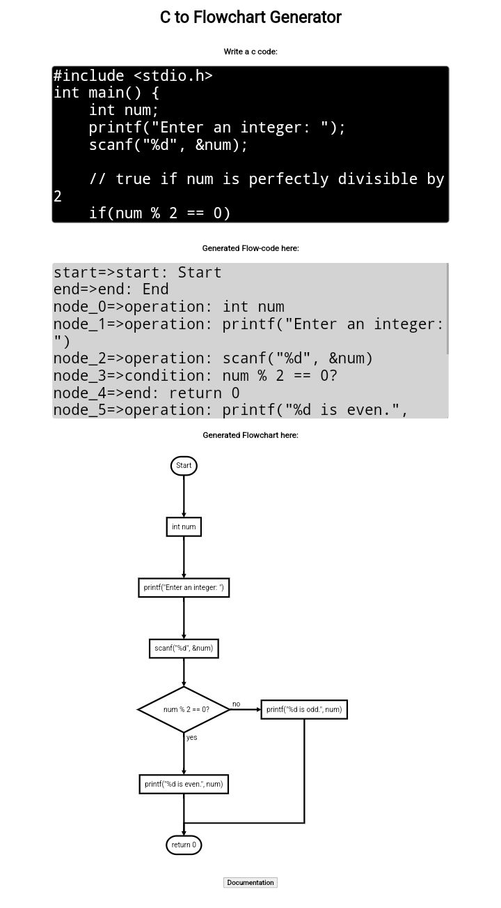

# C2Flow


C to Flowchart Generator show us graphical representation of execution step of C code.
### C Code Examples
1.
```C++
#include <stdio.h>
int main() 
{
   printf("Hello, World!");
}
```
2.
```C++
#include <stdio.h>
int main() {   
    int number;
   
    printf("Enter an integer: ");  
    
    // reads and stores input
    scanf("%d", &number);

    // displays output
    printf("You entered: %d", number);
    
    return 0;
}
```
3.
```C++
#include <stdio.h>
int main() {
    int num;
    printf("Enter an integer: ");
    scanf("%d", &num);

    // true if num is perfectly divisible by 2
    if(num % 2 == 0)
        printf("%d is even.", num);
    else
        printf("%d is odd.", num);
    
    return 0;
}
```


